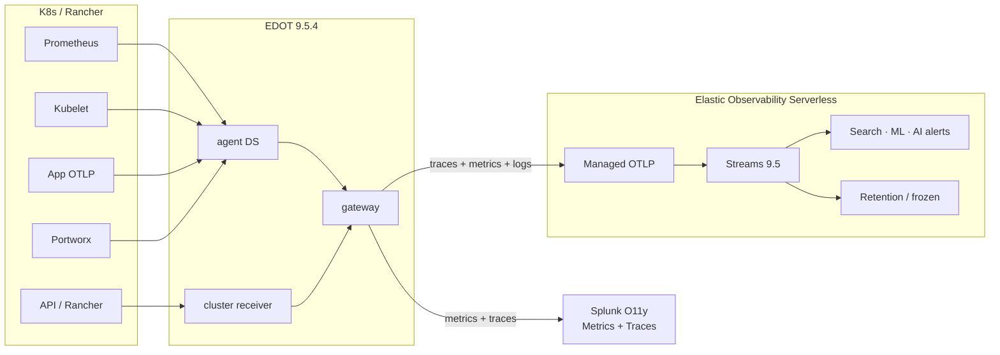

# Alternative architecture: Elastic Observability Serverless

Same sources and Splunk dual-run as the whiteboard. **Elastic Observability Serverless** replaces self-managed ES + ClickHouse admin overhead.

```text
┌─────────────────────────────────────┐
│  Kubernetes / Rancher cluster       │
│  Prometheus · Kubelet · API/Rancher │
│  Portworx · App Metrics             │
│         Traces / Metrics / Logs     │
└─────────────────┬───────────────────┘
                  │
                  ▼
        ┌─────────────────────┐
        │  EDOT Collector     │
        │  9.5.4              │
        │  agent (DaemonSet)  │
        │  cluster receiver   │
        │  gateway            │
        └─────────┬───────────┘
           ┌──────┴──────┐
           │             │
           ▼             ▼
┌──────────────────┐   ┌──────────────────────────────────────┐
│ Splunk O11y /    │   │ Elastic Observability Serverless     │
│ SignalFx         │   │                                      │
│ Metrics + Traces │   │ Managed OTLP                         │
│ Dashboards+Alerts│   │ Streams 9.5                          │
│ (keep existing)  │   │  · downsample / dedup                │
└──────────────────┘   │  · no high-card penalty              │
                       │ Elasticsearch                        │
                       │  · anomaly / ML / AI alerts          │
                       │ Retention / searchable snapshots     │
                       │                                      │
                       │ No cluster · No sizing · SaaS        │
                       └──────────────────────────────────────┘

Optional: Kafka logs -> Fluentd/Vector -> Elastic (bypass collector if needed)
```

## Why Serverless here

| Whiteboard path | Serverless alternative |
|---|---|
| Elastic Stream → self-managed / hosted ES | **Observability Serverless** (managed OTLP + Streams) |
| ClickHouse as compute / Iceberg | **Not required for STAGE** — keep lakehouse as later dual-write if needed |
| High admin (capacity, nodes, CH cluster) | **SaaS** — Elastic runs the data plane |

## Same collector topology

| Role | Deploy | Image |
|---|---|---|
| agent | DaemonSet | `elastic-otel-collector:9.5.4` |
| k8s-cluster-receiver | Deployment | same |
| gateway | Deployment | same → Splunk OTLP + Elastic managed OTLP |

Configs: [`edot-gateway.yaml`](./edot-gateway.yaml), [`edot-kube-stack-values.yaml`](./edot-kube-stack-values.yaml)

## Mermaid



## What this deliberately drops for STAGE

- ClickHouse / Iceberg as a required hop  
- Self-managed Elasticsearch capacity planning  
- A second metrics store for Elastic-side analytics  

Splunk stays for existing dashboards/alerts. Elastic Serverless becomes the metrics + logs + traces system of record without running a cluster.
